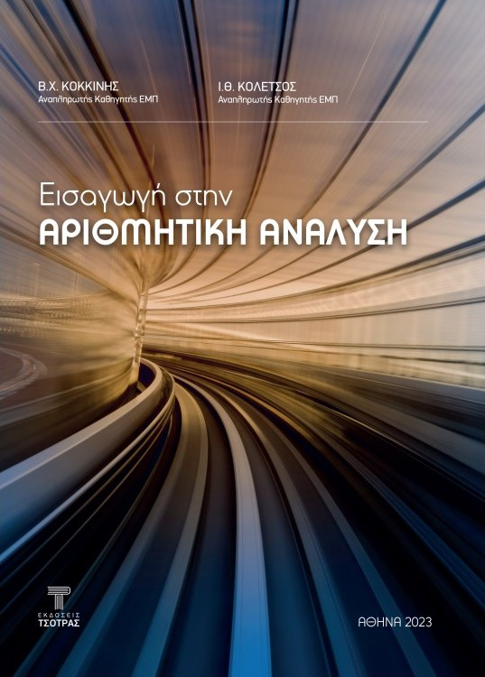

<p align="center">
  
</p>

<h1 align="center">Εισαγωγή στην Αριθμητική Ανάλυση</h1>

<p align="center">
  <strong>Β. Χ. Κοκκίνης &nbsp;·&nbsp; Ι. Θ. Κολέτσος</strong><br>
  <sub>Αναπληρωτές Καθηγητές, Εθνικό Μετσόβιο Πολυτεχνείο</sub>
</p>

<p align="center">
  Εκδόσεις Τσότρας, Αθήνα 2023 · 428 σελίδες · 11 κεφάλαια<br>
  <strong>Κωδικός Ευδόξου <code>122075205</code></strong> · ISBN 978-618-217-046-5
</p>

<p align="center">
  <a href="pdf/periexomena.pdf"><strong>Πίνακας περιεχομένων</strong></a>
  &nbsp;·&nbsp;
  <a href="pdf/deigma-kefalaio-2.pdf"><strong>Δείγμα κεφαλαίου</strong></a>
  &nbsp;·&nbsp;
  <a href="https://numericalanalysis.gr/"><strong>numericalanalysis.gr</strong></a>
</p>

---

Ένα πλήρες εγχειρίδιο αριθμητικής ανάλυσης για **ένα εξάμηνο διδασκαλίας** —
από την αριθμητική κινητής υποδιαστολής και τη διάδοση σφαλμάτων, μέχρι τις
αριθμητικές μεθόδους επίλυσης συνήθων διαφορικών εξισώσεων.

Η δομή είναι σταθερή σε όλα τα κεφάλαια: θεωρητική ανάπτυξη κάθε μεθόδου με
έμφαση στο **σφάλμα**, την **ευστάθεια** και την **ταχύτητα σύγκλισης**, και
στη συνέχεια λυμένες ασκήσεις, εφαρμογές σε πρακτικά προβλήματα και άλυτες
ασκήσεις. Το τελευταίο κεφάλαιο συγκεντρώνει προβλήματα για υπολογιστή,
οργανωμένα ανά κεφάλαιο, για το εργαστηριακό σκέλος του μαθήματος.

## Περιεχόμενα

| | Κεφάλαιο | Ενότητες |
|---:|---|---|
| **1** | Αριθμητική κινητής υποδιαστολής | Συστήματα κινητής υποδιαστολής · Συσσώρευση σφαλμάτων στρογγύλευσης |
| **2** | Επίλυση μη γραμμικών εξισώσεων | Εντοπισμός ριζών · Διχοτόμηση · Εσφαλμένη θέση · Σταθερό σημείο · Newton–Raphson · Τέμνουσα · Επιτάχυνση σύγκλισης |
| **3** | Επίλυση γραμμικών συστημάτων | Gauss · Gauss–Jordan · Παραγοντοποίηση · Νόρμες · Ευστάθεια · Jacobi · Gauss–Seidel · Χαλάρωση · Ελαχιστοποίηση · Υποχώροι Krylov |
| **4** | Επαναληπτικές μέθοδοι για μη γραμμικά συστήματα | Σταθερό σημείο · Newton–Raphson |
| **5** | Υπολογισμός ιδιοτιμών και ιδιοδιανυσμάτων | Μέθοδος των δυνάμεων · QR · Perron–Frobenius |
| **6** | Παρεμβολή | Lagrange · Hermite · Τμηματικά πολυωνυμικές συναρτήσεις |
| **7** | Διακριτά ελάχιστα τετράγωνα | Γραμμική, πολυωνυμική και εκθετική προσέγγιση |
| **8** | Αριθμητική παραγώγιση | Πεπερασμένες διαφορές · Προσδιοριστέοι συντελεστές · Richardson |
| **9** | Αριθμητική ολοκλήρωση | Lagrange · Hermite · Ορθογώνια πολυώνυμα · Ολοκλήρωση Gauss |
| **10** | Αριθμητικές μέθοδοι για ΣΔΕ | Αρχικές τιμές · Μονοβηματικές · Πολυβηματικές · Συστήματα · Άκαμπτα (stiff) |
| **11** | Προβλήματα για υπολογιστή | Προβλήματα υλοποίησης για τα κεφάλαια 1–10 |

Βιβλιογραφία (αγγλική και ελληνική) · Ευρετήριο αγγλικών και ελληνικών όρων

📄 **[Αναλυτικός πίνακας περιεχομένων με σελιδοποίηση (PDF)](pdf/periexomena.pdf)**

## Δείγμα

📘 **[Κεφάλαιο 2 — Επίλυση μη γραμμικών εξισώσεων](pdf/deigma-kefalaio-2.pdf)** —
πλήρες κεφάλαιο, σελίδες 27–104.

## Σε ένα εξάμηνο

Ενδεικτική κατανομή της ύλης σε 13 εβδομάδες.

| Εβδομάδα | Ύλη |
|---|---|
| 1 | Κεφ. 1 — Αριθμητική κινητής υποδιαστολής, σφάλματα στρογγύλευσης |
| 2 – 3 | Κεφ. 2 — Επίλυση μη γραμμικών εξισώσεων |
| 4 – 6 | Κεφ. 3 — Επίλυση γραμμικών συστημάτων, άμεσες και επαναληπτικές μέθοδοι |
| 7 | Κεφ. 4 — Επαναληπτικές μέθοδοι για μη γραμμικά συστήματα |
| 8 | Κεφ. 5 — Ιδιοτιμές και ιδιοδιανύσματα |
| 9 | Κεφ. 6 — Παρεμβολή |
| 10 | Κεφ. 7 — Διακριτά ελάχιστα τετράγωνα |
| 11 | Κεφ. 8 & 9 — Αριθμητική παραγώγιση και ολοκλήρωση |
| 12 – 13 | Κεφ. 10 — Αριθμητικές μέθοδοι για συνήθεις διαφορικές εξισώσεις |

Το Κεφάλαιο 11 τρέχει παράλληλα στο εργαστήριο: δίνει προβλήματα υλοποίησης
αντίστοιχα με κάθε ενότητα της θεωρίας.

## Πού διδάσκεται

Τμήματα που έχουν δηλώσει το σύγγραμμα στον Εύδοξο για το **2026–2027**:

- **Εθνικό Μετσόβιο Πολυτεχνείο** — Εφαρμοσμένων Μαθηματικών & Φυσικών
  Επιστημών · Ηλεκτρολόγων Μηχανικών & Μηχανικών Υπολογιστών ·
  Μεταλλειολόγων Μεταλλουργών Μηχανικών · Πολιτικών Μηχανικών
- **Αριστοτέλειο Πανεπιστήμιο Θεσσαλονίκης** — Μαθηματικών · Αγρονόμων &
  Τοπογράφων Μηχανικών
- **Πανεπιστήμιο Μακεδονίας** — Εφαρμοσμένης Πληροφορικής, και οι δύο
  κατευθύνσεις
- **Πανεπιστήμιο Δυτικής Αττικής** — Ναυπηγών Μηχανικών
- **Πανεπιστήμιο Πειραιώς** — Στατιστικής & Ασφαλιστικής Επιστήμης
- **Πανεπιστήμιο Αιγαίου** — Στατιστικής & Αναλογιστικών–Χρηματοοικονομικών
  Μαθηματικών

## Πού θα το βρείτε

**[Εύδοξος — κωδικός 122075205](https://service.eudoxus.gr/search/#a/id:122075205/0)**
Από εκεί γίνεται η δήλωση από τη Γραμματεία του Τμήματος και η διανομή στους
φοιτητές.

**[Εκδόσεις Τσότρας](https://www.ekdoseis-tsotras.gr/index.php?route=product/product&product_id=637)**
Για αγορά, καθώς και για αίτημα **αντιτύπου αξιολόγησης** από διδάσκοντες που
εξετάζουν το σύγγραμμα για το μάθημά τους.

---

<details>
<summary><sub><strong>Τεχνικά — για αυτό το repository</strong></sub></summary>

<br>

Πηγαίος κώδικας του [numericalanalysis.gr](https://numericalanalysis.gr/).
Στατική σελίδα, ένα αρχείο, χωρίς build step, χωρίς JavaScript, χωρίς
εξαρτήσεις.

```
index.html                    η σελίδα
assets/cover.jpg              εξώφυλλο
pdf/periexomena.pdf           αναλυτικός πίνακας περιεχομένων
pdf/deigma-kefalaio-2.pdf     Κεφ. 2 (σελ. 27-104)
CNAME                         custom domain για GitHub Pages
```

Τα δύο PDF προέρχονται από την επίσημη καρτέλα του βιβλίου στον Εύδοξο
(`static.eudoxus.gr/books/05/`) και φιλοξενούνται εδώ ώστε η σελίδα να μην
εξαρτάται από τα paths τους.

**Deploy:** GitHub Pages από το `main`, root.

DNS στον registrar:

```
A     @    185.199.108.153
A     @    185.199.109.153
A     @    185.199.110.153
A     @    185.199.111.153
CNAME www  teddyk.github.io
```

**Συντήρηση:** η ενότητα «Πού διδάσκεται» παράγεται από τα δεδομένα του
Ευδόξου και θέλει ενημέρωση μία φορά τον χρόνο, όταν κλειδώνουν οι δηλώσεις
(συνήθως Νοέμβριο).

</details>
